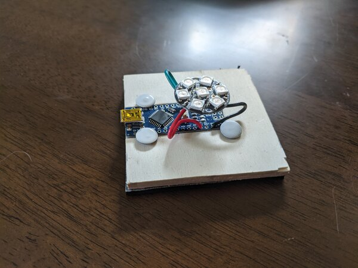
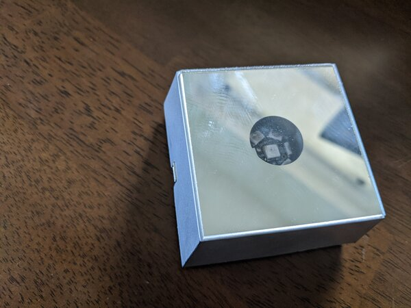

# Selenite Lamp

USB powered/controlled LED base to light up a Selenite crystal (or other
transparent object) preprogrammed with a range of routines.

TODO: Add video of lamp

## Hardware

The unit is just a [Neopixel Jewel 7](https://www.adafruit.com/product/2226)
connected to an Arduino Nano. I used solid core 22 AWG wire and mounted it to a
piece of craft wood with thumb tacks, and added a layer of [foam
padding](https://www.amazon.com/gp/product/B091NT395Z)
underneath. Solid core wires are a good choice since they're stiff enough to
hold the Neopixel board in place.



I happened to have an enclosure from a cheap base I'd bought before. All you
really need is an enclosure with a gap for the USB port and a transparent top.



## Installation

### Arduino sketch

Install `selenite.ino` on your Arduino. Depending on how you wired your
circuit, you may need to adjust `PIN` to the number of whichever data pin you
wired the Neopixel to.

Installation with `arduino-cli`:

```
arduino-cli compile --fqbn arduino:avr:nano
arduino-cli upload --fqbn arduino:avr:nano -p /dev/selenite-lamp
```

### CLI

Currently the CLI depends on nightly Rust (see rust-lang/rust#60553). Build
with cargo:

```
cargo build --release
```

This will generate a standalone binary at `target/release/selenite-lamp`.

## CLI Usage

```
selenite-lamp 0.2.1

USAGE:
    selenite-lamp [OPTIONS] <SERIAL_PORT> <SUBCOMMAND>

ARGS:
    <SERIAL_PORT>    Serial port to connect to. Something like `/dev/ttyUSB0` or `COM1` [env:
                     SELENITE_PORT=/dev/selenite-lamp]

OPTIONS:
    -v, --verbose    Print verbose output
    -h, --help       Print help information
    -V, --version    Print version information

SUBCOMMANDS:
    query         Query the current command state
    stop          Turn off the lights
    cycle-hues    Cycle through the rainbow
    pulse-hue     Pulse a specific hue
    show-rgb      Show a specific RGB color
    gleam         Randomly pulse groups of leds to create a gleaming effect
    watch-file    Watch the provided file for json, and update when it changes
    help          Print this message or the help of the given subcommand(s)
```

Most subcommands take parameters. Use `selenite-lamp help <SUBCOMMAND>` for
details.

Instead of providing the serial port as an argument, you can set the
`SERIAL_PORT` environment variable which you can then set in `~/.bashrc` (or
configuration file for whatever shell you use).

### Examples

```
selenite-lamp /dev/ttyUSB0 query
```

```
selenite-lamp /dev/selenite-lamp gleam 20000 0.004
```

```
SELENITE_PORT=/dev/ttyUSB0 selenite-lamp cycle-hues
```

## udev symlink

On systems with `udev` (most modern Linux systems), you can create a `udev`
rule to configure the USB port and create a named symlink when the lamp is
plugged in. This way you can have the device at a consistent location (say
`/dev/selenite-lamp`).

The `udev` rule should look something like:

```
/etc/udev/rules.d/99-selenite-lamp.rules

SUBSYSTEM=="tty", ATTRS{idVendor}=="1a86", ATTRS{idProduct}=="7523", SYMLINK+="selenite-lamp", RUN+="/bin/stty -F /dev/selenite-lamp -hupcl"
```

where the vendor and product ids are the actual values from your Arduino (I'm
using a cheap Arduino clone, your values will probably be different!). You can
find those values by running:

```
sudo dmesg | grep usb
```

with the lamp plugged in, and looking for your Arduino's values.

Note that the `udev` rules need to be reloaded before new rules take effect:

```
sudo udevadm control --reload-rules
```
